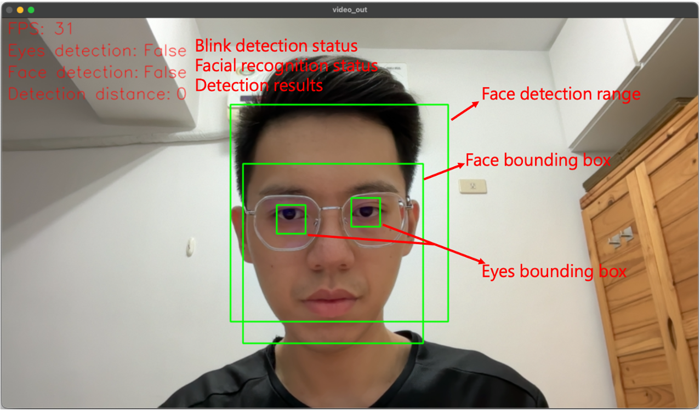
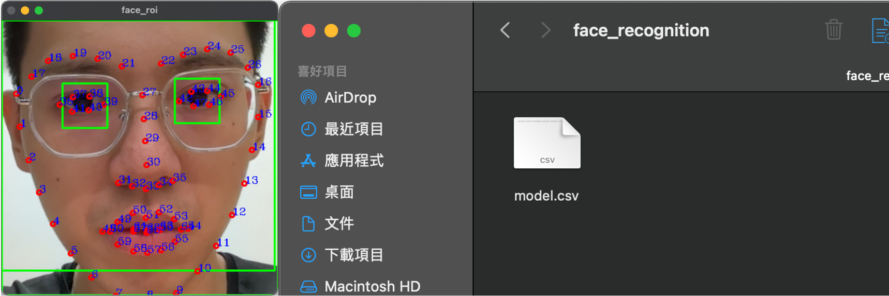
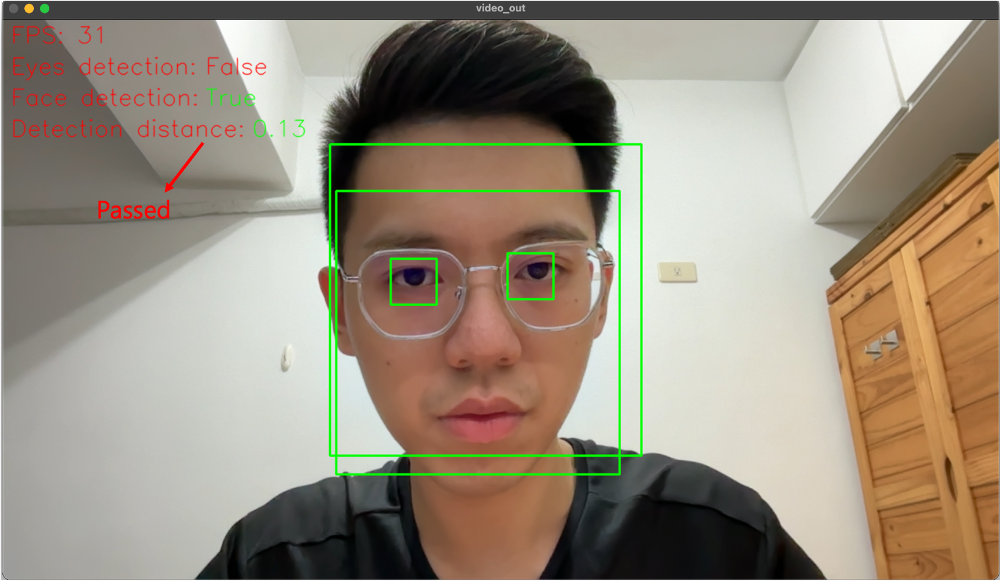
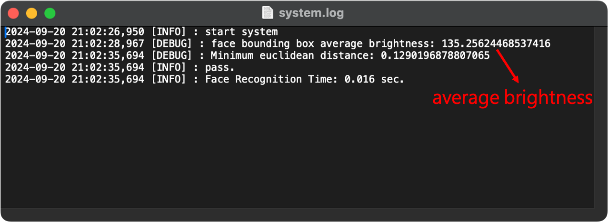
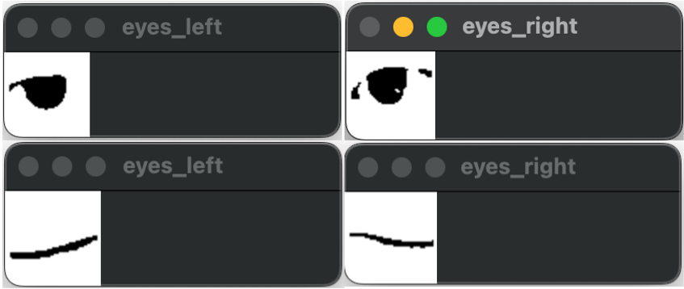
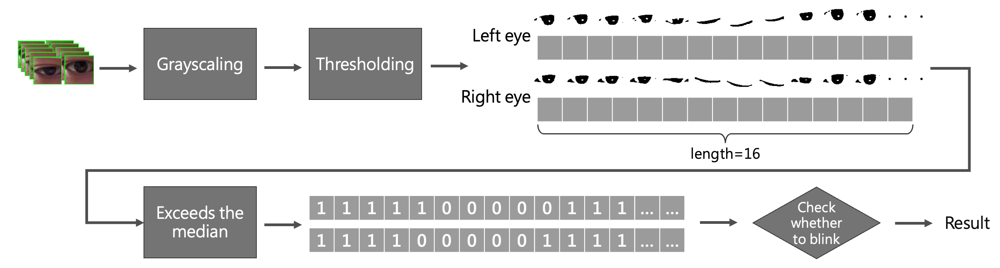

# Face Recognition_en

[English Version]() | [繁體中文版](./README_zh-tw.md)

[](https://www.python.org/downloads/release/python-396/)[](https://pypi.org/project/dlib-bin/19.22.0/)[](https://pypi.org/project/mediapipe/)[](https://pypi.org/project/cmake/)

## Description

This project was developed using the Python programming language, utilizing Dlib and Mediapipe to create a small facial recognition access control system.

Dlib itself has facial tracking capabilities, but its tracking speed is slow. Therefore, I introduced Google’s Mediapipe for face tracking, passing the detected faces to Dlib for recognition, significantly improving overall performance. However, I quickly realized that relying solely on facial features for recognition could not differentiate between a real person and an image in front of the camera. To address this issue, I further employed OpenCV for image processing, detecting blinks of the left and right eyes to determine if the subject is a real person. Only if the subject is real will the system proceed with recognition.

## System requirements

- Web Camera or IP Camera *1 (30 FPS)
- OS: Windows / Mac OS / ubuntu (Any system that supports Python and packages)
- Application: Indoor bright fluorescent light space
- Python packages:
    - Python 3.9,
    - ruff 0.12.5
    - dynaconf 3.2.6
    - numpy 1.26.4
    - dlib 19.22.0
    - mediapipe 0.10.5
    - cmake 3.30.2+
    - opencv-python 4.10.0+

## Installation

### Git clone
```
git clone https://github.com/JiangXiu11200/FaceRecognition.git
```

### Install uv environment tools

Install uv (You can refer to [GitHub: astral/uv](https://github.com/astral-sh/uv))
```
pip install uv
```

Though uv and pyproject to build virtual environment
```
uv sync
```


### Download Dlib model
- Official website:
  - [Dlib C++ Library](http://dlib.net/)
- Official download link:
  - [dlib_face_recognition_resnet_model_v1](https://dlib.net/files/dlib_face_recognition_resnet_model_v1.dat.bz2)
  - [shape_predictor_68_face_landmarks](https://dlib.net/files/shape_predictor_68_face_landmarks.dat.bz2)
- Local download link:
  - [dlib_face_recognition_resnet_model_v1](https://drive.google.com/file/d/1VcyOqEBOWIOuIx0L-jwQFdZ-BtkDnAtV/view?usp=sharing)
  - [shape_predictor_68_face_landmarks](https://drive.google.com/file/d/15XQmMtGZRBo7N4aHPUvZxKIgIDbd7qQ2/view?usp=sharing)

## Setup

### Folder structure

> '*' is a subdirectory
> The *logs* and *models* directories need to be created by yourself
```
FaceRecognition
  ├──.gitignore
  ├──face_detection.py
  ├──logger_config.conf
  ├──README.md
  ├──requirements.txt
  ├──run_test.py
  ├──setting.json
  ├──*logs*
  ├──*models*
  │   └─dlib
  │      ├─ dlib_face_recognition_resnet_model_v1.dat
  │      └─ shape_predictor_68_face_landmarks.dat
  ├──*package*
  │      ├─ __init__.py
  │      ├─ blink_detector.py
  │      ├─ calculation.py
  │      ├─ config.py
  │      ├─ coordinate_detection.py
  │      ├─ predictor.py
  │      ├─ settings.py
  │      └─ video_capturer.py
  └──*tests*
      ├─ test_calculation.py
      ├─ test_coordinate_detection.py
      ├─ test_predictor.py
      └─*test_data*
         └─ test_image.npz
```

### System configuration

The system directory contains a settings.json configuration file.
```json=
{
  "video_config": {
    "rtsp": "<RTSP URL (str) or Web Camera (int)>",
    "image_height": "<Image height (int)>",
    "image_width": "<Image width (int)>",
    "detection_range_start_point": [
      "<Bounding box top-left coordinate point x (int)>",
      "<<Bounding box top-left coordinate point y (int)>"
    ],
    "detection_range_end_point": [
      "<Bounding box bottom-right coordinate point x (int)>",
      "<Bounding box bottom-right coordinate point y (int)"
    ]
  },
  "sys_config": {
    "debug": true,
    "logs_path": "<Directory path for output logs (str)>"
  },
  "reco_config": {
    "enable": true,
    "set_mode": "<Set to true to save facial features (bool)>",
    "enable_blink_detection": "<Enable blink detection (bool)>",
    "dlib_predictor": "<shape_predictor_68_face_landmarks.dat model path (str)>",
    "dlib_recognition_model": "<dlib_face_recognition_resnet_model_v1.dat model path (str)>",
    "face_model": "<Face recognition model.csv path (str)>",
    "minimum_bounding_box_height": "<Face distance threshold (float)>",
    "minimum_face_detection_score": "<Face detection confidence score (float)>",
    "eyes_detection_brightness_threshold": "<Average brightness threshold (int)>",
    "eyes_detection_brightness_value": [
      "<threshold value in brighter environment (int)>",
      "<threshold value in darker environment (int)>"
    ],
    "sensitivity": "<Euclidean distance difference for face detection (float)>",
    "consecutive_prediction_intervals": "<Detection interval fps (int)>"
  }
}
```

- video_config: Input video settings
    - rtsp: Input video path, can be RTSP or Web Camera
    - image_height: Image resize height
    - image_width: Image resize width
    - detection_range_start_point: Face detection range, bounding box top-left coordinates
    - detection_range_end_point: Face detection range, bounding box bottom-right coordinates

- sys_config: System settings
    - debug: Debug mode
    - logs_path: Path for writing log files

- reco_config: Face recognition parameters
    - enable: Enable detection functionality
    - set_mode: Enable feature extraction functionality, outputs detected faces to models.csv
    - enable_blink_detection: Enable eyes blink detection
    - dlib_predictor: Path to the Dlib 68 face landmarks model
    - dlib_recognition_model: Path to Dlib face recognition ResNet model
    - face_model: Path to store the registered facial feature model (.csv file)
    - minimum_bounding_box_height: Face distance threshold; a larger number means the face must be closer to the camera for recognition. The default for FHD cameras is 0.4
    - minimum_face_detection_score: Face detection confidence score, default is 0.8
    - eyes_detection_brightness_threshold: Preprocessing average brightness threshold for blink detection
    - eyes_detection_brightness_value: Dynamic binarization threshold for blink detection preprocessing; adjusts binarization parameters based on brightness in bright or dark environments
    - sensitivity: Euclidean distance difference for face detection; a lower value indicates a higher detection pass rate
    - consecutive_prediction_intervals: Interval between consecutive face detection attempts in FPS


You can refer to my settings:
Place the dlib model in the /models/dlib/ directory and use the Web Camera on your computer to start the system.

```json=
{
  "video_config": {
    "rtsp": 0,
    "image_height": 720,
    "image_width": 1280,
    "detection_range_start_point": [
      420,
      160
    ],
    "detection_range_end_point": [
      820,
      560
    ]
  },
  "sys_config": {
    "debug": true,
    "logs_path": "logs"
  },
  "reco_config": {
    "enable": true,
    "set_mode": true,
    "enable_blink_detection": true,
    "dlib_predictor": "models/dlib/shape_predictor_68_face_landmarks.dat",
    "dlib_recognition_model": "models/dlib/dlib_face_recognition_resnet_model_v1.dat",
    "face_model": "models/face_recognition/model.csv",
    "minimum_bounding_box_height": 0.4,
    "minimum_face_detection_score": 0.6,
    "eyes_detection_brightness_threshold": 120,
    "eyes_detection_brightness_value": [
      50,
      20
    ],
    "sensitivity": 0.4,
    "consecutive_prediction_intervals": 90
  }
}
```

### Execution

```
uv run python face_detection.py
```

### Debug mode operation method

| Keypress | Actions |
| -------- | -------- |
| `S` or `s` | Register Face |
| `R` or `r` | Execute Recognition |
| `Q` or `q` | Exit |

- Register Face: When a face enters the recognition area, pressing ‘S’ or ‘s’ will calculate the facial features and output the result to a CSV file.
- Execute Recognition: After registering the facial features, the system must be restarted. Upon restarting, the system will read the CSV data. When a face re-enters the recognition area, pressing ‘R’ or ‘r’ will perform facial detection.
- Exit: Close the system.

### Non-Debug Mode Startup (Debug = false)

When starting with debug=false, once a face enters the recognition area and the system detects a blink, the recognition mechanism will automatically trigger to perform facial recognition.
The detection frequency is determined by the `consecutive_prediction_intervals` setting in the configuration file.

## Operation Example

### 1. Start the System


### 2. Face Registration
Press ‘S’ or ‘s’ on the keyboard, and the system will use the dlib model to capture facial feature points, saving them to model.csv.


The model.csv file stores the facial feature information of registered faces.


### 3. Face Recognition
Restart the system to load the model. After starting, press ‘R’ or ‘r’ on the keyboard to initiate facial recognition.


### 4. Eyes blink Parameters Configuration
The system configuration file includes two parameters: `eyes_detection_brightness_threshold` and `eyes_detection_brightness_value`. When the face gets closer to the camera, the system calculates the average brightness of the facial bounding box and logs it:

`eyes_detection_brightness_threshold` sets the brightness threshold, while `eyes_detection_brightness_value` is a list (list[int[], int[]]) used to set the binarization parameters for the eyes’ bounding box.
```json=
{
  ...
  "reco_config": {
    ...
    "eyes_detection_brightness_threshold": 120,
    "eyes_detection_brightness_value": [
      50,
      20
    ],
    ...
  }
}
```
If the current average brightness exceeds the set threshold, `eyes_detection_brightness_value[0]`will be the current threshold; otherwise, if it is below the average brightness threshold, `eyes_detection_brightness_value[1]`will be used as the current threshold. This method is not ideal because changes in ambient light are often hard to control, but I plan to improve this functionality in the future. For now, the current settings can handle indoor environments with stable lighting and minimal shadow variations.

Through real tests, we can observe the preprocessing results when eyes are open or closed. Based on known human behavior, the normal blink time is about 250ms. With a 30FPS camera, each frame is approximately 33.3333ms, so there will be around 7-8 frames per blink.

By processing frame by frame and calculating over 16 consecutive frames (the time for one blink and reopen), we can clearly observe the blink action.

### License
This project is licensed under the MIT License - see the [LICENSE](./LICENSE) file for details.

### Third-party Libraries

This project uses the following third-party libraries:

- [MediaPipe](https://github.com/google/mediapipe): Licensed under the Apache License 2.0.
- [dlib](http://dlib.net/): Licensed under the Boost Software License 1.0.

Please refer to their respective licenses for details.