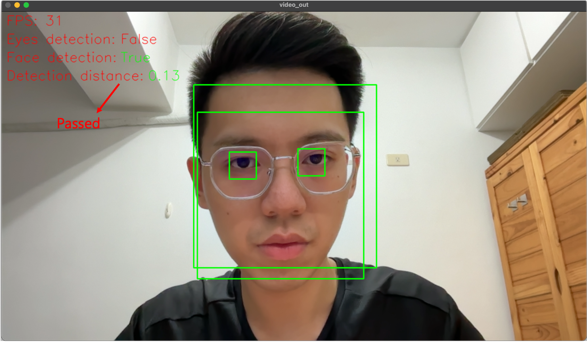

# Face Recognition

<p align="center">
  <a href="https://www.python.org/downloads/release/python-3100/">
    
  </a>
  <a href="https://fastapi.tiangolo.com/">
    
  </a>
  <a href="https://www.min.io/">
    
  </a>
  <a href="https://www.postgresql.org/">
    
  </a>
  <a href="https://pypi.org/project/dlib-bin/19.22.0/">
    
  </a>
  <a href="https://pypi.org/project/mediapipe/">
    
  </a>
</p>

<p align="center">
Readme Languages: <a href="./README_en.md">English 🇺🇸</a> / <a href="./README.md">繁體中文版 🇹🇼</a>
</p>

## Description

This project integrates OpenCV, Dlib, and MediaPipe to implement a facial recognition system, which is encapsulated as a microservice using FastAPI and connected to the web-based interface provided by [FaceRecoSystem](https://github.com/JiangXiu11200/FaceRecoSystem), forming a complete facial recognition solution.

While Dlib offers robust facial recognition capabilities, its performance in real-time face tracking is relatively limited. To improve speed, this project incorporates MediaPipe for real-time facial tracking, combined with custom ROI (Region of Interest) optimization, significantly enhancing overall efficiency.

Additionally, to address the issue where facial features alone cannot distinguish between a real person and a photo, this project integrates OpenCV for eye-region image processing and implements blink detection as an anti-spoofing mechanism. This ensures that the recognized subject is a real person, thereby improving system security.

## Features

- **Real-Time Face Recognition**: Implements face recognition using Dlib, with user registration and deletion capabilities for easy management.
- **Anti-Spoofing Verification**: Detects eye blinking to distinguish real persons from static photos.
- **FastAPI Microservice**: RESTful API design for easy integration and deployment.
- **Static File Storag**: Integrates MinIO (S3) to upload both successfully and unsuccessfully recognized face images, allowing for easy review and management.
- **Real-Time Communication**: Streams recognition images in real-time via WebSocket and pushes recognition results instantly.
- **Modular Architecture**: The face recognition module can run independently or be triggered via API.

## Architecture

### System


The system is mainly divided into the following components:
- **Face Recognition Service**: The core of face recognition, responsible for image capture and processing, facial feature extraction, feature difference calculation, and blink detection.
- **Connection Manager**: Handles Web Client WebSocket connections and various operations, including starting/stopping streams, image streaming, and real-time transmission of recognition results.
- **FaceApp Manager**: Receives commands from the Connection Manager and controls whether to start or stop the Face Recognition process.
- **Server Command Handler**: Processes RESTful API requests from [FaceRecoSystem](https://github.com/JiangXiu11200/FaceRecoSystem), including user registration, user deletion, and system parameter configuration.

### System Breakdown


In terms of system decomposition, it is divided into App_Server and Core Application.
The App_Server is built on FastAPI, implementing WebSocket and RESTful API functionalities to interface with the Web Client and [FaceRecoSystem](https://github.com/JiangXiu11200/FaceRecoSystem).
The Core Application is a facial recognition algorithm.

### Database ER Diagram


The database design is simple, consisting of four independent tables with no interrelationships:

- **VideoConfig**: Stores parameters for VideoCapture.
- **FaceRecognitionConfig**: Stores parameters for face recognition.
- **SystemLogs**: Stores recognition results.
- **SystenConfig**: Stores settings for the face recognition debug mode.

### Swagger API


- /api/health: Health Check [GET]: Check connection and service status.
- /api/face-reco-config [GET]: Read face recognition configuration.
- /api/face-reco-config [POST]: Update or create face recognition configuration.
- /api/debug [GET]: Get face recognition service debug mode settings.
- /api/debug [POST]: Update face recognition service debug mode settings.
- /api/video-config [GET]: Read face recognition configuration.
- /api/video-config [POST]: Update or create face recognition configuration.
- /api/register-face [POST]: Register a new face with the provided image and name.
- /api/delete-registered-face/{user_name} [POST]: Delete a registered face by name.
- /api/preview-camera/ [GET]: Preview camera stream.

## Get Started

### System requirements

System Requirements
- Hardware:
  - Web Camera or IP Camera *1 (30 FPS)
- Operating System:
  - Windows / macOS / Ubuntu
- Recommended Environment:
  - Well-lit indoor setting
- Main Dependencies:
  - Python 3.10
  - dlib 19.22.0
  - mediapipe 0.10.5
  - opencv-python 4.10
  - fastapi 0.116.0
  - minio 7.2.16

## Installation

Before getting started, please install Python 3.10 and the uv package management tool. uv is an efficient environment and package manager that allows you to quickly set up the project environment.

### Install uv environment tools

Install uv (You can refer to [GitHub: astral/uv](https://github.com/astral-sh/uv))
```
pip install uv
```

Though uv and pyproject to build virtual environment
```
uv sync
```

### Download Dlib model

- Official website:
  - [Dlib C++ Library](http://dlib.net/)
- Official download link:
  - [dlib_face_recognition_resnet_model_v1](https://dlib.net/files/dlib_face_recognition_resnet_model_v1.dat.bz2)
  - [shape_predictor_68_face_landmarks](https://dlib.net/files/shape_predictor_68_face_landmarks.dat.bz2)
- Local download link:
  - [dlib_face_recognition_resnet_model_v1](https://drive.google.com/file/d/1VcyOqEBOWIOuIx0L-jwQFdZ-BtkDnAtV/view?usp=sharing)
  - [shape_predictor_68_face_landmarks](https://drive.google.com/file/d/15XQmMtGZRBo7N4aHPUvZxKIgIDbd7qQ2/view?usp=sharing)

## Run in Standalone Mode

> Run facial recognition independently. If you want to use FastAPI, please skip to [FastAPI Mode](#run-in-fastapi-mode)


### System configuration

The system directory contains a settings.json configuration file.
```json=
{
  "video_config": {
    "rtsp": "<RTSP URL (str), If using web camera set null>",
    "web_camera": "<Web Camera ID (int), If using RTSP set null>",
    "image_height": "<Image height (int)>",
    "image_width": "<Image width (int)>",
    "detection_range_start_point": [
      "<Bounding box top-left coordinate point x (int)>",
      "<<Bounding box top-left coordinate point y (int)>"
    ],
    "detection_range_end_point": [
      "<Bounding box bottom-right coordinate point x (int)>",
      "<Bounding box bottom-right coordinate point y (int)"
    ]
  },
  "sys_config": {
    "debug": true,
    "logs_path": "<Directory path for output logs (str)>"
  },
  "reco_config": {
    "enable": true,
    "set_mode": "<Set to true to save facial features (bool)>",
    "enable_blink_detection": "<Enable blink detection (bool)>",
    "dlib_predictor": "<shape_predictor_68_face_landmarks.dat model path (str)>",
    "dlib_recognition_model": "<dlib_face_recognition_resnet_model_v1.dat model path (str)>",
    "face_model": "<Face recognition model.csv path (str)>",
    "minimum_bounding_box_height": "<Face distance threshold (float)>",
    "minimum_face_detection_score": "<Face detection confidence score (float)>",
    "eyes_detection_brightness_threshold": "<Average brightness threshold (int)>",
    "eyes_detection_brightness_value": [
      "<threshold value in brighter environment (int)>",
      "<threshold value in darker environment (int)>"
    ],
    "sensitivity": "<Euclidean distance difference for face detection (float)>",
    "consecutive_prediction_intervals": "<Detection interval fps (int)>"
  }
}
```

- video_config: Input video settings
  - rtsp: Path to the video stream (string). If the video source is a string path, use the rtsp field and set web_camera to None.
  - web_camera: Camera index (integer). If the video source is an integer, use the web_camera field and set rtsp to an empty string "".
  - image_height: Resized image height.
  - image_width: Resized image width.
  - detection_range_start_point: Face detection range, bounding box top-left coordinates.
  - detection_range_end_point: Face detection range, bounding box bottom-right coordinates.

- sys_config: System settings
    - debug: Debug mode.
    - logs_path: Path for writing log files.

- reco_config: Face recognition parameters
    - enable: Enable the detection feature.
    - set_mode: Enable feature extraction mode, which outputs the detected face to models.csv.
    - enable_blink_detection: Enable blink detection for liveness verification.
    - dlib_predictor: Path to the Dlib 68 face landmarks model file.
    - dlib_recognition_model: Path to the Dlib face recognition ResNet model file.
    - face_model: Path to the registered face feature model (.csv file).
    - minimum_bounding_box_height: Face distance threshold (0.1~1.0). Higher values require the face to be closer to the camera for recognition. Default is 0.4 for FHD cameras.
    - minimum_face_detection_score: Minimum confidence score for face detection. Default is 0.8.
    - eyes_detection_brightness_threshold: Average brightness threshold for pre-processing in blink detection (0~255).
    - eyes_detection_brightness_value: Dynamic threshold for image binarization during blink detection [0~255, 0~255]. Adjust this for bright or dark environments (experimental feature).
    - sensitivity: Euclidean distance threshold for face verification (0.0~1.0). Lower values indicate stricter matching (higher accuracy).
    - consecutive_prediction_intervals: Interval for consecutive face recognition attempts, based on camera FPS. For example, if the camera runs at 30 FPS, setting this to 90 means recognition occurs every 3 seconds.


You can refer to my settings:
Place the dlib model in the /models/dlib/ directory and use the Web Camera on your computer to start the system.

```json=
{
  "video_config": {
    "rtsp": null,
    "web_camera": 0,
    "image_height": 720,
    "image_width": 1280,
    "detection_range_start_point": [
      420,
      160
    ],
    "detection_range_end_point": [
      820,
      560
    ]
  },
  "sys_config": {
    "debug": true,
    "logs_path": "logs"
  },
  "reco_config": {
    "enable": true,
    "set_mode": true,
    "enable_blink_detection": true,
    "dlib_predictor": "models/dlib/shape_predictor_68_face_landmarks.dat",
    "dlib_recognition_model": "models/dlib/dlib_face_recognition_resnet_model_v1.dat",
    "face_model": "models/face_recognition/model.csv",
    "minimum_bounding_box_height": 0.4,
    "minimum_face_detection_score": 0.6,
    "eyes_detection_brightness_threshold": 120,
    "eyes_detection_brightness_value": [
      50,
      20
    ],
    "sensitivity": 0.4,
    "consecutive_prediction_intervals": 90
  }
}
```

### Execution

```
uv run python face_detection.py
```

### Debug mode operation method

| Keypress | Actions |
| -------- | -------- |
| `S` or `s` | Register Face |
| `R` or `r` | Execute Recognition |
| `Q` or `q` | Exit |

- Register Face: When a face enters the recognition area, press ‘S’ or ‘s’ to compute its feature vector and export the result to the CSV path specified in face_model.
- Run Recognition: After registering a face, restart the system. Upon restart, the system loads the stored face features. When a face enters the recognition area again, press ‘R’ or ‘r’ to perform face detection.
- Exit: Close the system.

### Product mode operation method

When sys_config.Debug is set to False, the system automatically starts recognition once a face enters the recognition area.
If reco_config.enable_blink_detection is set to True, recognition will be triggered when a blink is detected.


## Operation Example

### 1. Start the System


### 2. Face Registration
Press ‘S’ or ‘s’ on the keyboard, and the system will use the dlib model to capture facial feature points, saving them to model.csv.


The model.csv file stores the facial feature information of registered faces.


### 3. Face Recognition
Restart the system to load the model. After starting, press ‘R’ or ‘r’ on the keyboard to initiate facial recognition.


### 4. Eyes blink Parameters Configuration
The system configuration file includes two parameters: `eyes_detection_brightness_threshold` and `eyes_detection_brightness_value`. When the face gets closer to the camera, the system calculates the average brightness of the facial bounding box and logs it:

`eyes_detection_brightness_threshold` sets the brightness threshold, while `eyes_detection_brightness_value` is a list (list[int[], int[]]) used to set the binarization parameters for the eyes’ bounding box.
```json=
{
  ...
  "reco_config": {
    ...
    "eyes_detection_brightness_threshold": 120,
    "eyes_detection_brightness_value": [
      50,
      20
    ],
    ...
  }
}
```
If the current average brightness exceeds the set threshold, `eyes_detection_brightness_value[0]`will be the current threshold; otherwise, if it is below the average brightness threshold, `eyes_detection_brightness_value[1]`will be used as the current threshold. This method is not ideal because changes in ambient light are often hard to control, but I plan to improve this functionality in the future. For now, the current settings can handle indoor environments with stable lighting and minimal shadow variations.

Through real tests, we can observe the preprocessing results when eyes are open or closed. Based on known human behavior, the normal blink time is about 250ms. With a 30FPS camera, each frame is approximately 33.3333ms, so there will be around 7-8 frames per blink.

By processing frame by frame and calculating over 16 consecutive frames (the time for one blink and reopen), we can clearly observe the blink action.


## Tests

To ensure each functional module operates as expected and to prevent logical errors, calculation mistakes, or improper data structure handling during development, unit tests are executed using Unittest for every development cycle:


The test coverage includes validation of computational results and data types for each sub-module, ensuring not only correctness under normal conditions but also system stability and predictable behavior under abnormal scenarios.

## Run in FastAPI Mode

Before getting started, please install Docker and Docker Compose, as the MinIO S3 service will be launched using Docker.

### Install and Start Minio S3

> Reference GitHub: [minio](https://github.com/minio/minio)

Docker pull

```bash
sudo docker pull quay.io/minio/minio:RELEASE.2025-07-23T15-54-02Z
```

Create a MinIO S3 local static directory

```bash
mkdir /minio
```

Run MinIO S3 using Docker-compose
Set the root user and password

```yaml
version: "3.8"
services:
  minio:
    image: quay.io/minio/minio
    container_name: minio
    restart: always
    ports:
      - "9000:9000"
      - "9001:9001"
    volumes:
      - /minio:/data
    environment:
      MINIO_ROOT_USER: <YOUR_USERNAME>
      MINIO_ROOT_PASSWORD: <YOUR_PASSWORD>
      MINIO_SERVER_URL: "http://127.0.0.1:9000"
      MINIO_BROWSER_REDIRECT_URL: "http://127.0.0.1:9001"
    command: server /data --console-address ":9001"
```

```bash
sudo docker-compose up
```

Initialize Buckets

```bash
uv run python3 app_server/utils/create_buckets.py
```

### Environment Settings

FastAPI environment variables can be configured via a `.env` file, where SERVER_ENDPOINT and the `External Log Server` correspond to the endpoint and API URL used when integrating with [FaceRecoSystem](https://github.com/JiangXiu11200/FaceRecoSystem).


```
# Server Configuration
SERVER_ENDPOINT=<YOUR_SERVER_IP:PORT_OR_DOMAIN>

# Database Configuration
DATABASE_URL=sqlite:///./face_detection.db

# External Log Server 
EXTERNAL_ACTIVITY_LOGS_SERVER_URL = "http://localhost:8000/api/activity-logs/face-recognition/"
EXTERNAL_ALARM_LOGS_SERVER_URL = "http://localhost:8000/api/alarm-logs/"


# MinIO S3 Configuration

UPLOAD_TO_S3=True

MINIO_ENDPOINT=127.0.0.1:9000
MINIO_ACCESS_KEY=<YOUR_MINIO_ACCESS_USERNAME>
MINIO_SECRET_KEY=<YOUR_MINIO_ACCESS_PASSWORD>

CONNECT_TIMEOUT=10
READ_TIMEOUT=1
TOTAL_TIMEOUT=30

MAX_RETRIES=0
BACKOFF_FACTOR=0.3
POOL_MAXSIZE=10
POOL_BLOCK=False

ENABLE_SSL=False
CA_PATH=
```

### Execution

```
uv run uvicorn main:app --host 0.0.0.0 --port 8001 --reload
```

### Tests

To ensure the stability and security of the system’s API under various scenarios, we have implemented comprehensive unit and integration tests, covering:

- Positive Testing: Verify that the API behaves as expected with valid inputs.
- Negative Testing: Check that abnormal or erroneous inputs are safely handled.
- Monkey Testing: Test the system’s robustness using random or unexpected data, ensuring it does not crash due to unforeseen inputs.

Through these tests, the API’s functionality and system stability can be continuously validated throughout the development process.


### License
This project is licensed under the MIT License - see the [LICENSE](./LICENSE) file for details.

### Third-party Libraries

This project uses the following third-party libraries:

- [MediaPipe](https://github.com/google/mediapipe): Licensed under the Apache License 2.0.
- [dlib](http://dlib.net/): Licensed under the Boost Software License 1.0.
- [minio](https://github.com/minio/minio)： Licensed under the AGPL-3.0 License.

Please refer to their respective licenses for details.