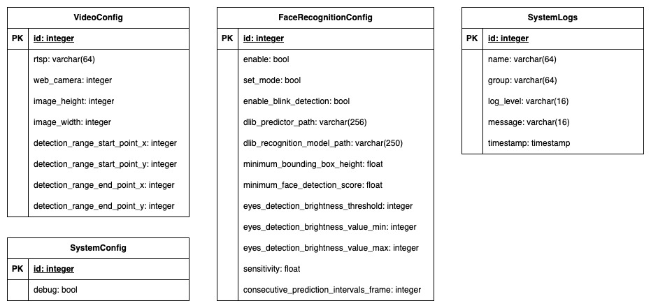
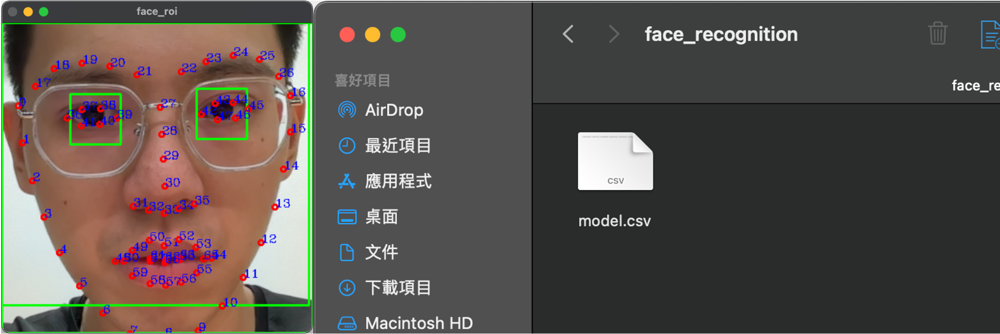
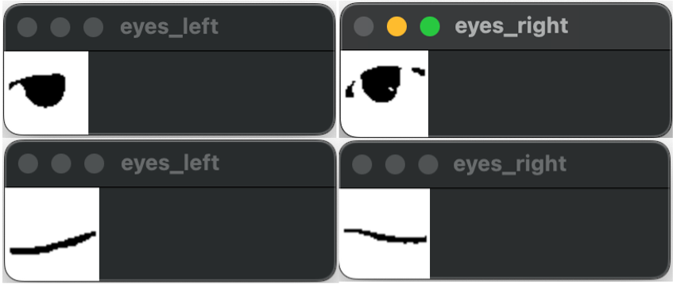
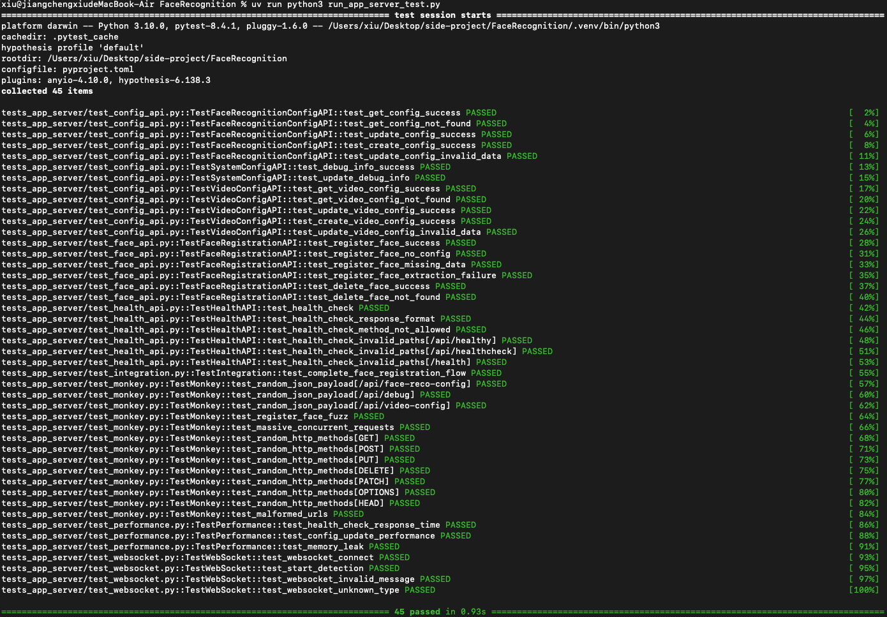

# Face Recognition_zh-TW

<p align="center">
  <a href="https://www.python.org/downloads/release/python-3100/">
    
  </a>
  <a href="https://fastapi.tiangolo.com/">
    
  </a>
  <a href="https://www.min.io/">
    
  </a>
  <a href="https://www.postgresql.org/">
    
  </a>
  <a href="https://pypi.org/project/dlib-bin/19.22.0/">
    
  </a>
  <a href="https://pypi.org/project/mediapipe/">
    
  </a>
</p>

<p align="center">
Readme Languages: <a href="./README.md">English 🇺🇸</a> / <a href="./README_zh-tw.md">繁體中文版 🇹🇼</a>
</p>

## Description

本專案結合 OpenCV、Dlib 與 Mediapipe，實現人臉辨識功能，並透過 FastAPI 封裝成微服務與 [FaceRecoSystem](https://github.com/JiangXiu11200/FaceRecoSystem) 提供的網頁系統串接，整合成一項完整的人臉辨識系統。

Dlib 具備穩定的人臉辨識功能，但在人臉追蹤效能上相對不足。為提升速度，本專案加入了 MediaPipe 進行即時人臉追蹤，並搭配自訂 ROI (Region of Interest) 進行優化，顯著提升整體效能。

且為解決僅靠人臉特徵無法區分「真人」與「照片」的問題，本專案額外整合 OpenCV 做眼睛部分的影像處理，實作 眨動檢測 作為防偽機制，確保辨識對象為真人，提升系統安全性。

## Features

- **即時人臉辨識**：利用 Dlib 實現人臉辨識，並提供用戶註冊與刪除功能，便於管理。
- **防偽驗證**：透過 眼睛眨動檢測 區分真人與靜態照片。
- **FastAPI 微服務**：RESTful API 設計，易於整合與部署。
- **靜態檔案儲存**：將辨識成功或失敗的人臉影像上傳，便於後續查閱與管理。
- **即時通訊**：透過 WebSocket 即時串流辨識影像，並即時推送辨識結果。
- **模組化架構**：人臉辨識模組可獨立運行，也可透過 API 調用啟動。

## Architecture

### System


系統主要分為幾個部分：

- **Face Recognition Servic**：人臉辨識核心，負責影像擷取與處理、人臉特徵擷取、特徵差異計算、眨眼辨識等主要功能。
- **Connection Manager**：負責 Wev Client 的 Web Socket 連線與各種操作，包括啟與停用串流、影像串流、辨識結果資訊即時傳遞。
- **FaceApp Manager**：負責接收 Connection Manager 的指令，控制是否建立或關閉 Face Recognition 程序。
- **Server Command Handler**：負責處理來自 [FaceRecoSystem](https://github.com/JiangXiu11200/FaceRecoSystem) 所發出的 RESTFul API ，用於註冊用戶、刪除用戶、系統參數設置等功能。

### System Breakdown


在系統分解上，則分為 App_Server 與 Core Application，其中 App_Server 以 FastAPI 為核心開發 WebSocket 與 RESTFul API 公能，用於對接 Web Client 與  [FaceRecoSystem](https://github.com/JiangXiu11200/FaceRecoSystem)；而 Core Application 為人臉辨識核心算法。

### Database ER Diagram



資料庫部分則分為四張獨立的資料表，非常單純，彼此並無互相關聯。

- **VideoConfig**：存放 VideoCapture 時的參數。
- **FaceRecognitionConfig**：人臉辨識參數。
- **SystemLogs**：辨識結果。
- **SystenConfig**：人臉辨識 Debug 模式設定。


### Swagger API


- /api/health: Health Check [GET]: Check connection and service status.
- /api/face-reco-config [GET]: Read face recognition configuration.
- /api/face-reco-config [POST]: Update or create face recognition configuration.
- /api/debug [GET]: Get face recognition service debug mode settings.
- /api/debug [POST]: Update face recognition service debug mode settings.
- /api/video-config [GET]: Read face recognition configuration.
- /api/video-config [POST]: Update or create face recognition configuration.
- /api/register-face [POST]: Register a new face with the provided image and name.
- /api/delete-registered-face/{user_name} [POST]: Delete a registered face by name.
- /api/preview-camera/ [GET]: Preview camera stream.

## Get Started

### System requirements

- 硬體需求：
  - Web Camera or IP Camera *1 (30 FPS)
- 作業系統:
  - Windows / Mac OS / ubuntu
- 最佳使用環境:
  - 室內明亮環境
- 主要套件:
    - python 3.10,
    - dlib 19.22.0
    - mediapipe 0.10.5
    - opencv-python 4.10
    - fastapi 0.116.0
    - minio 7.2.16

### Installation

開始前，請先安裝 Python 3.10 版本以及 uv 套件管理工具。uv 是一個高效的環境與套件管理工具，可快速建立本專案所需環境。


#### 下載 uv 環境管理工具

下載 uv tools (參考 [GitHub: astral/uv](https://github.com/astral-sh/uv))

```
pip install uv
```

透過 uv 與 pyproject.toml 建立虛擬環境
```
uv sync
```

#### 下載 Dlib 模型

- 官方網站:
  - [Dlib C++ Library](http://dlib.net/)
- 官方載點: 
  - [dlib_face_recognition_resnet_model_v1](https://dlib.net/files/dlib_face_recognition_resnet_model_v1.dat.bz2)
  - [shape_predictor_68_face_landmarks](https://dlib.net/files/shape_predictor_68_face_landmarks.dat.bz2)
- 本地載點:
  - [dlib_face_recognition_resnet_model_v1](https://drive.google.com/file/d/1VcyOqEBOWIOuIx0L-jwQFdZ-BtkDnAtV/view?usp=sharing)
  - [shape_predictor_68_face_landmarks](https://drive.google.com/file/d/15XQmMtGZRBo7N4aHPUvZxKIgIDbd7qQ2/view?usp=sharing)


## Run in Standalone Mode

> 獨立執行人臉辨識，若要透過 FastAPI，請跳到 [FastAPI Mode](#run-in-fastapi-mode)


### System configuration

系統目錄中包含了一個 settings.json 設定檔，其說明如下:
```json=
{
  "video_config": {
    "rtsp": "<RTSP URL (str), If using web camera set null>",
    "web_camera": "<Web Camera ID (int), If using RTSP set null>",
    "image_height": "<Image height (int)>",
    "image_width": "<Image width (int)>",
    "detection_range_start_point": [
      "<Bounding box top-left coordinate point x (int)>",
      "<<Bounding box top-left coordinate point y (int)>"
    ],
    "detection_range_end_point": [
      "<Bounding box bottom-right coordinate point x (int)>",
      "<Bounding box bottom-right coordinate point y (int)"
    ]
  },
  "sys_config": {
    "debug": true,
    "logs_path": "<Directory path for output logs (str)>"
  },
  "reco_config": {
    "enable": true,
    "set_mode": "<Set to true to save facial features (bool)>",
    "enable_blink_detection": "<Enable blink detection (bool)>",
    "dlib_predictor": "<shape_predictor_68_face_landmarks.dat model path (str)>",
    "dlib_recognition_model": "<dlib_face_recognition_resnet_model_v1.dat model path (str)>",
    "face_model": "<Face recognition model.csv path (str)>",
    "minimum_bounding_box_height": "<Face distance threshold (float)>",
    "minimum_face_detection_score": "<Face detection confidence score (float)>",
    "eyes_detection_brightness_threshold": "<Average brightness threshold (int)>",
    "eyes_detection_brightness_value": [
      "<threshold value in brighter environment (int)>",
      "<threshold value in darker environment (int)>"
    ],
    "sensitivity": "<Euclidean distance difference for face detection (float)>",
    "consecutive_prediction_intervals": "<Detection interval fps (int)>"
  }
}
```

- video_config: 輸入影像設定
    - rtsp: 影像路徑(string)。若影像路徑為字串，使用 rtsp 欄位，web_camera 設為 None。
    - web_camera: 影像路徑(integer)。若影像路徑為整數，使用 web_camera 欄位，rtsp 設為 ""。
    - image_height: 影像resize高
    - image_width: 影像resize寬
    - detection_range_start_point: 人臉檢測範圍，bounding box左上座標
    - detection_range_end_point: 人臉檢測範圍，bounding box右下座標
- sys_config: 系統設定
    - debug: debug模式。
    - logs_path: 寫出log檔案路徑
- reco_config: 人臉辨識參數minimum_face_detection_score: 
    - enable: 開啟檢測功能
    - set_mode: 開啟特徵擷取功能，會輸出當前鏡頭下人臉到models.csv
    - enable_blink_detection: 開啟眨眼辨識功能
    - dlib_predictor: Dlib 68 face landmarks模型路徑
    - dlib_recognition_model: Dlibface recognition resnet模型路徑
    - face_model: 存放登錄的人臉特徵模型路徑 (.csv file)
    - minimum_bounding_box_height: 人臉距離判斷 0.1~1.0, 數字越大代表人臉距離鏡頭越近才會辨識, FHD鏡頭預設0.4
    - minimum_face_detection_score: 人臉檢測信心分數, 預設為0.8
    - eyes_detection_brightness_threshold: 眨眼檢測影像前處理平均亮度門檻 0~255
    - eyes_detection_brightness_value: 眨眼檢測前處理的二值化動態門檻 [0~255, 0~255], 透過亮度門檻條整明亮或陰暗時的二值化參數 (測試中)
    - sensitivity: 人臉檢測歐幾裡得距離差 0.0~1.0，數值越低表示檢測通過率更高
    - consecutive_prediction_intervals: 連續進行人臉檢測的fps間隔, 依攝影機幀數，假設攝影機為 30fps, 設為參數設為90 等同於3秒辨識一次


你可以參考我的設定:
將dlib模型放置/models/dlib/目錄下，並使用電腦上的Web Camera來啟動系統。

```json=
{
  "video_config": {
    "rtsp": null,
    "web_camera": 0,
    "image_height": 720,
    "image_width": 1280,
    "detection_range_start_point": [
      420,
      160
    ],
    "detection_range_end_point": [
      820,
      560
    ]
  },
  "sys_config": {
    "debug": true,
    "logs_path": "logs"
  },
  "reco_config": {
    "enable": true,
    "set_mode": true,
    "enable_blink_detection": true,
    "dlib_predictor": "models/dlib/shape_predictor_68_face_landmarks.dat",
    "dlib_recognition_model": "models/dlib/dlib_face_recognition_resnet_model_v1.dat",
    "face_model": "models/face_recognition/model.csv",
    "minimum_bounding_box_height": 0.4,
    "minimum_face_detection_score": 0.6,
    "eyes_detection_brightness_threshold": 120,
    "eyes_detection_brightness_value": [
      50,
      20
    ],
    "sensitivity": 0.4,
    "consecutive_prediction_intervals": 90
  }
}
```

### Execution

```
uv run python face_detection.py
```

### Debug mode operation method

若將 sys_config.Debug 設為 True，則需透過鍵盤事件驅動。

| 按鍵 | 動作 |
| -------- | -------- |
| `S` or `s` | 登錄人臉 |
| `R` or `r` | 執行辨識 |
| `Q` or `q` | 關閉 |

- 登錄人臉: 當人臉進入辨識區域內時，按下'S'或's'會將人臉進行特徵運算並輸出結果至 face_model 所設定的 csv 路徑。
- 執行辨識: 人臉特徵後必須重新啟動系統，重啟後系統會讀入人臉特徵，當人臉再次進入辨識區域內時，按下 'R' 或 'r' 進行人臉檢測。
- 離開: 關閉系統。

### Product Mode operation method

當 sys_config.Debug 設為 False 時，當人臉進入辨識區域後，系統會自動開始辨識。若 reco_config.enable_blink_detection 為 True，當系統偵測到雙眼眨眼，則會觸發辨識。

## 操作實例

### 1. 啟動系統


### 2. 登錄人臉

按下鍵盤'S'或's'，系統會透過dlib模型取得人臉特徵點，並輸出至model.csv中。


model.csv中儲存了登錄的人臉特徵資訊。


### 3. 人臉辨識

重新啟動系統，使其將model載入。啟動後，按下鍵盤'R'或'r'進行辨識。


### 4. 眨眼參數設定

系統設定檔中包含了`eyes_detection_brightness_threshold`和`eyes_detection_brightness_value`兩項參數。當臉部靠近鏡頭時，系統會計算臉部bounding box的平均亮度，並顯示在log檔中:

`eyes_detection_brightness_threshold`用以設置該亮度門檻，`eyes_detection_brightness_value`為一個一維陣列list[int[], int[]]，用以設定眼睛bounding box的二值化參數。
```json=
{
  ...
  "reco_config": {
    ...
    "eyes_detection_brightness_threshold": 120,
    "eyes_detection_brightness_value": [
      50,
      20
    ],
    ...
  }
}
```
若當前的平均亮度大於所設定的平均亮度門檻時，則eyes_detection_brightness_value[0]會是當前的門檻；反之，小於平均亮度門檻，擇eyes_detection_brightness_value[1]會是當前的門檻。這樣的方式並不好，因為環境光的改變通常是較難控制的因素，這在未來我將會繼續改進該功能，但目前的設定已經可以應對一些室內明亮並且無太大光影變化的環境。

實際測試眼睛在睜眼與閉眼時的前處理結果，透過物理的已知，人類在正常的眨眼時間約250ms，以30FPS攝影機做計算，每幀約33.3333ms，故我們可以得到每一次眨眼約會有7~8幀的變化。

透過逐幀除理的方式，計算連續16幀(也就是一次的眨眼與睜眼的時間) 我們就可以很明顯地看出眨眼的動作變化。

## Tests

為確保每個功能模組依預期運作，並避免開發過程中出現邏輯錯誤、計算錯誤或資料結構處理不當，每次開發時，以 Unittest 進行單元測試：


測試內容涵蓋每個子功能的運算結果與資料型態驗證，不僅確保系統在正常操作下的正確性，也保障在異常情況下的穩定性與可預期行為。

## Run in FastAPI Mode

開始之前，請先安裝 Docker 與 Docker-compose 環境，MinIO S3 會以 Docker 的方式啟動。

### Install and Start Minio S3

> 參考 GitHub: [minio](https://github.com/minio/minio)

Docker pull

```bash
sudo docker pull quay.io/minio/minio:RELEASE.2025-07-23T15-54-02Z
```

建立 MinIO S3 本地靜態目錄

```bash
mkdir /minio
```

透過 Docker-compose 執行 MinIO S3
設定 root user 與 password

```yaml
version: "3.8"
services:
  minio:
    image: quay.io/minio/minio
    container_name: minio
    restart: always
    ports:
      - "9000:9000"
      - "9001:9001"
    volumes:
      - /minio:/data
    environment:
      MINIO_ROOT_USER: <YOUR_USERNAME>
      MINIO_ROOT_PASSWORD: <YOUR_PASSWORD>
      MINIO_SERVER_URL: "http://127.0.0.1:9000"
      MINIO_BROWSER_REDIRECT_URL: "http://127.0.0.1:9001"
    command: server /data --console-address ":9001"
```

```bash
sudo docker-compose up
```

初始化建立 Buckets
```bash
uv run python3 app_server/utils/create_buckets.py
```

### 環境設定

透過 `.env` 可以設定 FastAPI 環境變數，其中 SERVER_ENDPOINT 與 `External Log Server` 為 [FaceRecoSystem](https://github.com/JiangXiu11200/FaceRecoSystem) 啟用時的 Endpoint 與 API URL。

```
# Server Configuration
SERVER_ENDPOINT=<YOUR_SERVER_IP:PORT_OR_DOMAIN>

# Database Configuration
DATABASE_URL=sqlite:///./face_detection.db

# External Log Server 
EXTERNAL_ACTIVITY_LOGS_SERVER_URL = "http://localhost:8000/api/activity-logs/face-recognition/"
EXTERNAL_ALARM_LOGS_SERVER_URL = "http://localhost:8000/api/alarm-logs/"


# MinIO S3 Configuration

UPLOAD_TO_S3=True

MINIO_ENDPOINT=127.0.0.1:9000
MINIO_ACCESS_KEY=<YOUR_MINIO_ACCESS_USERNAME>
MINIO_SECRET_KEY=<YOUR_MINIO_ACCESS_PASSWORD>

CONNECT_TIMEOUT=10
READ_TIMEOUT=1
TOTAL_TIMEOUT=30

MAX_RETRIES=0
BACKOFF_FACTOR=0.3
POOL_MAXSIZE=10
POOL_BLOCK=False

ENABLE_SSL=False
CA_PATH=
```

### Execution

```
uv run uvicorn main:app --host 0.0.0.0 --port 8001 --reload
```

### Tests

為確保本系統 API 在各種情境下的穩定性與安全性，我們建立了完整的單元與整合測試，涵蓋：

- 正向測試：驗證 API 在正常輸入下是否如預期運作。
- 反向測試：檢查異常或錯誤輸入是否被安全處理。
- Monkey 測試：透過隨機或非預期資料測試系統魯棒性，確保不因意外輸入而崩潰。

透過這些測試，API 在開發過程中可以持續驗證功能正確性與系統穩定性。




## 授權條款

此專案採用 MIT 授權條款，詳情請參閱 [LICENSE](LICENSE) 。

### 第三方函式庫

此專案使用以下第三方函式庫：

- [MediaPipe](https://github.com/google/mediapipe)：採用 Apache 2.0 授權條款。
- [dlib](http://dlib.net/)：採用 Boost Software License 1.0 授權條款。
- [minio](https://github.com/minio/minio)：採用 AGPL-3.0 License 授權條款。

請參閱各自的授權條款以了解詳細資訊。