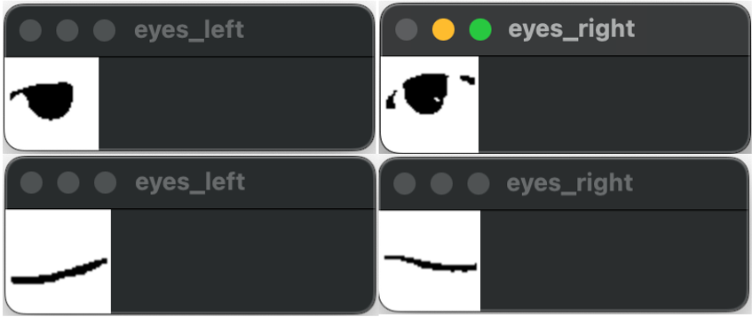

# Face Recognition_zh-TW

[English](#english-version) | [繁體中文版](#中文版)

[](https://www.python.org/downloads/release/python-396/)[](https://pypi.org/project/dlib-bin/19.22.0/)[](https://pypi.org/project/mediapipe/)[](https://pypi.org/project/cmake/)

## Description
本專案透過Python程式語言開發，運用Dlib與Mediapipe來實現一個人臉辨識門禁系統的小專案。

Dlib本身具備人臉追蹤功能，但其追蹤速度緩慢，因此我引入了Google的Mediapipe進行人臉追蹤，將捕捉到的人臉傳遞給Dlib進行辨識，大幅提升了整體運行效率。然而，很快我又發現單純依賴人臉特徵進行辨識，無法區分鏡頭中的人臉是真人還是圖像。為解決這個問題，進一步使用OpenCV進行純影像處理，透過檢測左眼與右眼的眨動，來辨識人物是否為真人，若為真人，才會進行辨識。

## System requirements

- Web Camera or IP Camera *1 (30 FPS)
- OS: Windows / Mac OS / ubuntu (任何支援Python和所需套件的系統)
- Application: 室內明亮環境
- Python packages:
    - Python 3.9+
    - Python Dlib 19.22.0
    - Mediapipe 0.10.5
    - cmake 3.30.2+
    - OpenCV 4.10.0+

## Installation

### Git clone
```
https://github.com/JiangXiu11200/FaceRecognition.git
```

### 下載所需套件

下載 cmake 3.30.2版
```
pip install cmake==3.30.2
```

執行requirements.txt 安裝套件
```
pip install -r requirements.txt
```

如果在Dlib安裝過程中遇到Build失敗等相關錯誤，可利用```pip list```檢查CMake是否安裝正確，然後再嘗試執行下列指令安裝19.22.0版本：
```
python -m pip install dlib==19.22.0
```

### 下載Dlib模型
- 官方網站:
  - [Dlib C++ Library](http://dlib.net/)
- 官方載點: 
  - [dlib_face_recognition_resnet_model_v1](https://dlib.net/files/dlib_face_recognition_resnet_model_v1.dat.bz2)
  - [shape_predictor_68_face_landmarks](https://dlib.net/files/shape_predictor_68_face_landmarks.dat.bz2)
- 本地載點:
  - [dlib_face_recognition_resnet_model_v1](https://drive.google.com/file/d/1VcyOqEBOWIOuIx0L-jwQFdZ-BtkDnAtV/view?usp=sharing)
  - [shape_predictor_68_face_landmarks](https://drive.google.com/file/d/15XQmMtGZRBo7N4aHPUvZxKIgIDbd7qQ2/view?usp=sharing)

## Setup

### Folder structure

> '*'為子目錄
logs, models需自行建立
```
FaceRecognition
  ├──.gitignore
  ├──face_detection.py
  ├──logger_config.conf
  ├──README.md
  ├──requirements.txt
  ├──run_test.py
  ├──setting.json
  ├──*logs*
  ├──*models*
  │   └─dlib
  │      ├─ dlib_face_recognition_resnet_model_v1.dat
  │      └─ shape_predictor_68_face_landmarks.dat
  ├──*package*
  │      ├─ __init__.py
  │      ├─ calculation.py
  │      ├─ config.py
  │      ├─ coordinate_detection.py
  │      ├─ predictor.py
  │      ├─ settings.py
  │      └─ video_capturer.py
  └──*tests*
      ├─ test_calculation.py
      ├─ test_coordinate_detection.py
      ├─ test_predictor.py
      └─*test_data*
         └─ test_image.npz
```

### System configuration

系統目錄中包含了一個Settings.json設定檔，其說明如下:
```json=
{
  "video_config": {
    "rtsp": "<RTSP URL (str) or Web Camera (int)>",
    "image_height": "<Image height (int)>",
    "image_width": "<Image width (int)>",
    "detection_range_start_point": [
      "<Bounding box top-left coordinate point x (int)>",
      "<<Bounding box top-left coordinate point y (int)>"
    ],
    "detection_range_end_point": [
      "<Bounding box bottom-right coordinate point x (int)>",
      "<Bounding box bottom-right coordinate point y (int)"
    ]
  },
  "sys_config": {
    "debug": true,
    "logs_path": "<Directory path for output logs (str)>"
  },
  "reco_config": {
    "enable": true,
    "set_mode": "<Set to true to save facial features (bool)>",
    "dlib_predictor": "<shape_predictor_68_face_landmarks.dat model path (str)>",
    "dlib_recognition_model": "<dlib_face_recognition_resnet_model_v1.dat model path (str)>",
    "face_model": "<Face recognition model.csv path (str)>",
    "minimum_bounding_box_height": "<Face distance threshold (float)>",
    "minimum_face_detection_score": "<Face detection confidence score (float)>",
    "eyes_detection_brightness_threshold": "<Average brightness threshold (int)>",
    "eyes_detection_brightness_value": [
      "<threshold value in brighter environment (int)>",
      "<threshold value in darker environment (int)>"
    ],
    "sensitivity": "<Euclidean distance difference for face detection (float)>",
    "consecutive_prediction_intervals": "<Detection interval fps (int)>"
  }
}
```

- video_config: 輸入影像設定
    - rtsp: 輸入影像路徑，可以是RTSP或Web Camera
    - image_height: 影像resize高
    - image_width: 影像resize寬
    - detection_range_start_point: 人臉檢測範圍，bounding box左上座標
    - detection_range_end_point: 人臉檢測範圍，bounding box右下座標
- sys_config: 系統設定
    - debug: debug模式
    - logs_path: 寫出log檔案路徑
- reco_config: 人臉辨識參數minimum_face_detection_score: 
    - enable: 開啟檢測功能
    - set_mode: 開啟特徵擷取功能，會輸出當前鏡頭下人臉到models.csv
    - dlib_predictor: Dlib 68 face landmarks模型路徑
    - dlib_recognition_model: Dlibface recognition resnet模型路徑
    - face_model: 存放登錄的人臉特徵模型路徑 (.csv file)
    - minimum_bounding_box_height: 人臉距離判斷, 數字越大代表人臉距離鏡頭越近才會辨識, FHD鏡頭預設0.4
    - minimum_face_detection_score: 人臉檢測信心分數, 預設為0.8
    - eyes_detection_brightness_threshold: 眨眼檢測影像前處理平均亮度門檻
    - eyes_detection_brightness_value: 眨眼檢測前處理的二值化動態門檻, 透過亮度門檻條整明亮或陰暗時的二值化參數
    - sensitivity: 人臉檢測歐幾裡得距離差，數值越低表示檢測通過率更高
    - consecutive_prediction_intervals: 連續進行人臉檢測的fps間隔


你可以參考我的設定:
將dlib模型放置/models/dlib/目錄下，並使用電腦上的Web Camera來啟動系統。

```json=
{
  "video_config": {
    "rtsp": 0,
    "image_height": 720,
    "image_width": 1280,
    "detection_range_start_point": [
      420,
      160
    ],
    "detection_range_end_point": [
      820,
      560
    ]
  },
  "sys_config": {
    "debug": true,
    "logs_path": "logs"
  },
  "reco_config": {
    "enable": true,
    "set_mode": true,
    "dlib_predictor": "models/dlib/shape_predictor_68_face_landmarks.dat",
    "dlib_recognition_model": "models/dlib/dlib_face_recognition_resnet_model_v1.dat",
    "face_model": "models/face_recognition/model.csv",
    "minimum_bounding_box_height": 0.4,
    "minimum_face_detection_score": 0.6,
    "eyes_detection_brightness_threshold": 120,
    "eyes_detection_brightness_value": [
      50,
      20
    ],
    "sensitivity": 0.4,
    "consecutive_prediction_intervals": 90
  }
}
```

### Execution

```
python face_detection.py
```

### Debug mode operation method

| 按鍵 | 動作 |
| -------- | -------- |
| `S` or `s` | 登錄人臉 |
| `R` or `r` | 執行辨識 |
| `Q` or `q` | 關閉 |

- 登錄人臉: 當人臉進入辨識區域內時，按下'S'或's'會將人臉進行特徵運算並輸出結果至csv。
- 執行辨識: 登錄完人臉特徵後必須重新啟動系統，重啟後系統會讀入csv資料，當人臉再次進入辨識區域內時，按下'R'或'r'進行人臉檢測。
- 離開: 關閉系統。

### 非Debug模式啟動 (Debug = false)

在非Debug模式下啟動，當人臉進入辨識區域後，系統偵測到眨眼，則會自動觸發辨識機制，進行人臉辨識，並且檢測的頻率為設定檔中的`consecutive_prediction_intervals`來決定。

## 操作實例

### 1. 啟動系統


### 2. 登錄人臉

按下鍵盤'S'或's'，系統會透過dlib模型取得人臉特徵點，並輸出至model.csv中。


model.csv中儲存了登錄的人臉特徵資訊。


### 3. 人臉辨識

重新啟動系統，使其將model載入。啟動後，按下鍵盤'R'或'r'進行辨識。


### 4. 眨眼參數設定

系統設定檔中包含了`eyes_detection_brightness_threshold`和`eyes_detection_brightness_value`兩項參數。當臉部靠近鏡頭時，系統會計算臉部bounding box的平均亮度，並顯示在log檔中:

`eyes_detection_brightness_threshold`用以設置該亮度門檻，`eyes_detection_brightness_value`為一個一維陣列list[int[], int[]]，用以設定眼睛bounding box的二值化參數。
```json=
{
  ...
  "reco_config": {
    ...
    "eyes_detection_brightness_threshold": 120,
    "eyes_detection_brightness_value": [
      50,
      20
    ],
    ...
  }
}
```
若當前的平均亮度大於所設定的平均亮度門檻時，則eyes_detection_brightness_value[0]會是當前的門檻；反之，小於平均亮度門檻，擇eyes_detection_brightness_value[1]會是當前的門檻。這樣的方式並不好，因為環境光的改變通常是較難控制的因素，這在未來我將會繼續改進該功能，但目前的設定已經可以應對一些室內明亮並且無太大光影變化的環境。

實際測試眼睛在睜眼與閉眼時的前處理結果，透過物理的已知，人類在正常的眨眼時間約250ms，以30FPS攝影機做計算，每幀約33.3333ms，故我們可以得到每一次眨眼約會有7~8幀的變化。

透過逐幀除理的方式，計算連續16幀(也就是一次的眨眼與睜眼的時間) 我們就可以很明顯地看出眨眼的動作變化。